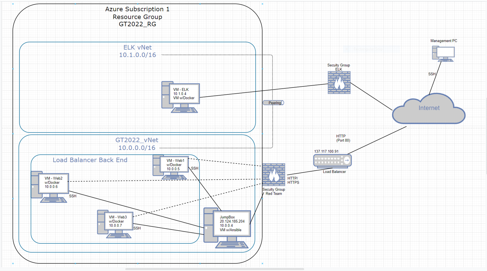
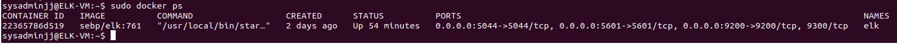
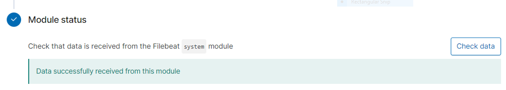

# GT_Project_1
## Automated ELK Stack Deployment

The files in this repository were used to configure the network depicted below.

These files have been tested and used to generate a live ELK deployment on Azure. They can be used to either recreate the entire deployment pictured above. Alternatively, select portions of the playbook file may be used to install only certain pieces of it, such as Filebeat.

  - [Filebeat playbook] (https://github.com/juanjoseg100/GT_Project_1/blob/main/Ansible/filebeat-playbook.yml).

This document contains the following details:
- Description of the Topology
- Access Policies
- ELK Configuration
  - Beats in Use
  - Machines Being Monitored
- How to Use the Ansible Build

### Description of the Topology

The main purpose of this network is to expose a load-balanced and monitored instance of DVWA, the D*mn Vulnerable Web Application.

Load balancing ensures that the application will be highly available, in addition to restricting access to the network.
- Load balancers distribute the traffic and distribute it across multiple resources, also can offload traffic and encrypt/decrypt data, and mitigate DoS attacks.
- A jump box helps you manage your infrastructure from a centralized device that will be the only one(s) allowed to ssh and manage specific configurations in your environment.

Integrating an ELK server allows users to easily monitor the vulnerable VMs for changes to the services running and system files.
- Filebeat logs information about the file system, including which files have changed and when.
- Metricbeat helps you monitor your servers by collecting metrics from the system and services running on the server.

The configuration details of each machine may be found below.

| Name     | Function | IP Address | Operating System |
|----------|----------|------------|------------------|
| Jump Box | Gateway  | 10.0.0.4   | Linux            |
| Web1     | Web App  | 10.0.0.5   | Linux            |
| Web2     | Web App  | 10.0.0.6   | Linux            |
| Web3     | Web App  | 10.0.0.7   | Linux            |
| ELK      | Kibana   | 10.0.0.8   | Linux            |
| Loadbal. | LB       | x.x.x.91   | Linux            |

### Access Policies

The machines on the internal network are not exposed to the public Internet. 

Only the jump box machine can accept connections from the Internet. Access to this machine is only allowed from the following IP addresses:
- 75.x.x.135

Machines within the network can only be accessed by the jump server via SSH.
- The ELK VM has same protection and restrictions where only public IP 75.x.x.135 can connect to it via SSH.

A summary of the access policies in place can be found in the table below.

| Name     | Publicly Accessible | Allowed IP Addresses |
|----------|---------------------|----------------------|
| Jump Box | Yes - SSH           | 75.x.x.135           |
| ELK -VM  | Yes - SSH           | 75.x.x.135           |
| Web VMs  | Yes - SSH           | 10.0.0.4             |

### Elk Configuration

Ansible was used to automate configuration of the ELK machine. No configuration was performed manually, which is advantageous because you can control what settings you
enable or disable based on requirements and you can use the same configuration file to push it to several, (hundreds) of devices at once within seconds without the
need to connect to each device.

The playbook implements the following tasks:
- Installs docker in the virtual machine, then we pushed python, increased the virtual memory, downloaded docker modules, opened specific TCP ports to allow 
  connectivity and allow ELK to run properly and made sure that the docker service was re-enabled in case of a server boot.

The following screenshot displays the result of running `docker ps` after successfully configuring the ELK instance.

### Target Machines & Beats
This ELK server is configured to monitor the following machines:
- 10.0.0.5 - Web1
- 10.0.0.6 - Web2
- 10.0.0.7 - Web3

We have installed the following Beats on these machines:
- Filebeat
- Metricbeat

These Beats allow us to collect the following information from each machine:
- We can collect and ship log files, collect and report various system-level metrics for various sytems and platforms.
- We can build tens of dials within a dashboard with logs and metrics that we want to monitor like AWS, S3's, Database Overview, Overiview of Docker containers, and many more.

### Using the Playbook
In order to use the playbook, you will need to have an Ansible control node already configured. Assuming you have such a control node provisioned: 

SSH into the control node and follow the steps below:
- Copy the Filebeat-config.yml file to your WebVM's.
- Update the hosts file to include the Ip addresses of your WebVM's.
- Run the playbook, and navigate to Module Status and Check Data to check that the installation worked as expected, as shown in the image below:.

_TODO: Answer the following questions to fill in the blanks:_
- _Which file is the playbook? Where do you copy it?_
- _Which file do you update to make Ansible run the playbook on a specific machine? How do I specify which machine to install the ELK server on versus which to install Filebeat on?_
- _Which URL do you navigate to in order to check that the ELK server is running?

_As a **Bonus**, provide the specific commands the user will need to run to download the playbook, update the files, etc._
